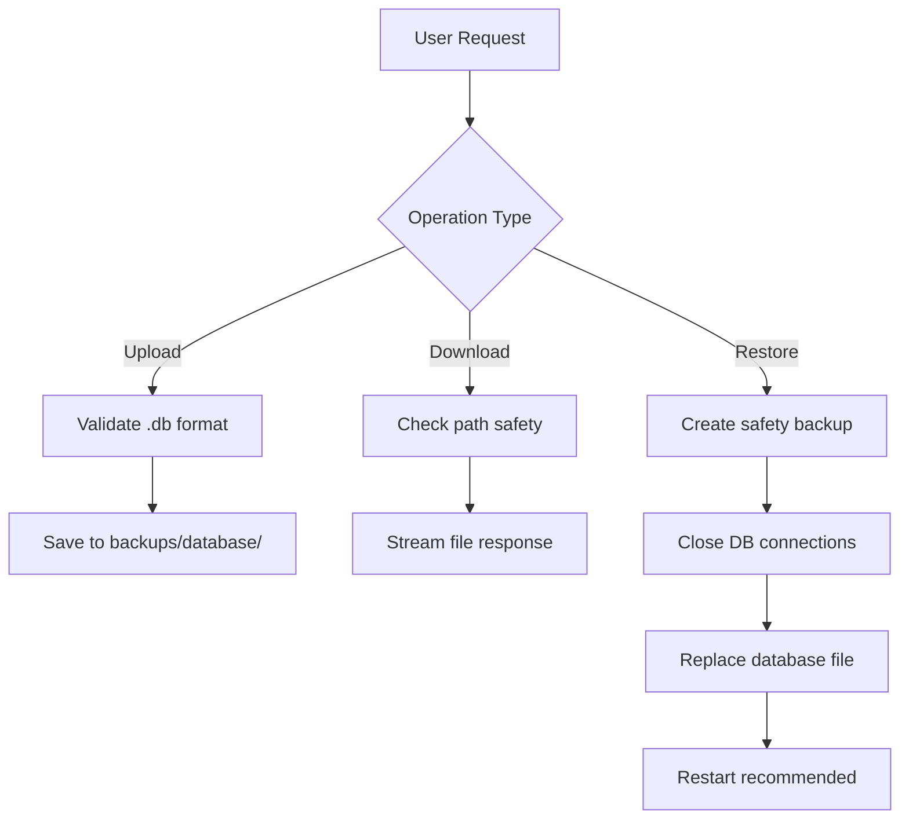

# Control Router Refactoring Guide

## Overview

**Version:** 1.8.0  
**Date:** November 19, 2025  
**Status:** Production Ready

This document describes the major architectural refactoring of the Control Panel API router system, which transformed a monolithic 1000+ line module into a maintainable, modular architecture while maintaining 100% backward compatibility.

## Table of Contents

- [Motivation](#motivation)
- [Architecture](#architecture)
- [Module Structure](#module-structure)
- [Migration Guide](#migration-guide)
- [Development Guidelines](#development-guidelines)
- [Testing Strategy](#testing-strategy)
- [Troubleshooting](#troubleshooting)

## Motivation

### Problems with the Monolithic Router

The original `backend/routers/routers_control.py` had grown to over 1000 lines with multiple responsibilities:

- **Maintainability**: Hard to navigate and understand
- **Testing**: Complex test setup due to interdependencies
- **Code reuse**: Duplicate utility functions across endpoints
- **Separation of concerns**: Mixed concerns (status, operations, monitoring, logs)
- **Scalability**: Difficult to add new features without increasing complexity

### Goals of the Refactoring

1. **Modularization**: Split into focused, single-responsibility modules
2. **Backward Compatibility**: Zero breaking changes for existing consumers
3. **Improved Maintainability**: Clear separation of concerns
4. **Better Testability**: Isolated test surfaces for each module
5. **Code Reuse**: Centralized shared utilities

## Architecture

### High-Level Design

```text
┌─────────────────────────────────────────────────────────────┐
│                    backend/main.py                          │
│                  (Application Entry)                        │
└───────────────────────────┬─────────────────────────────────┘
                            │
                            │ imports
                            ▼
┌─────────────────────────────────────────────────────────────┐
│           backend/routers/routers_control.py                │
│              (Compatibility Shim)                           │
│  • Re-exports combined router                               │
│  • Provides test hooks                                      │
│  • Enables gradual migration                                │
└───────────────────────────┬─────────────────────────────────┘
                            │
                            │ imports from
                            ▼
┌─────────────────────────────────────────────────────────────┐
│          backend/routers/control/__init__.py                │
│              (Router Aggregator)                            │
│  • Combines all submodule routers                           │
│  • Exports unified APIRouter                                │
└───────────────────────────┬─────────────────────────────────┘
                            │
        ┌───────────────────┼───────────────────┐
        │                   │                   │
        ▼                   ▼                   ▼
┌──────────────┐   ┌──────────────┐   ┌──────────────┐
│   base.py    │   │operations.py │   │monitoring.py │
│ Status &     │   │ Install,     │   │ Grafana/     │
│ Diagnostics  │   │ Build,       │   │ Prometheus   │
│ (5 endpoints)│   │ Backups      │   │ (6 endpoints)│
└──────────────┘   │(10+ endpoints)│   └──────────────┘
                   └──────────────┘
┌──────────────┐   ┌──────────────┐   ┌──────────────┐
│   logs.py    │   │housekeeping  │   │frontend_dev  │
│ Log          │   │ Restart/Exit │   │ Dev Server   │
│ Retrieval    │   │ (2 endpoints)│   │ (4 endpoints)│
│ (1 endpoint) │   └──────────────┘   └──────────────┘
└──────────────┘
        │
        └──────────────► common.py (Shared Utilities)
```

### Design Principles

1. **Single Responsibility**: Each module handles one domain
2. **Dependency Injection**: Shared utilities imported from `common.py`
3. **Composition over Inheritance**: Routers combined via `include_router()`
4. **Backward Compatibility**: Shim preserves legacy import paths
5. **Test Isolation**: Each module independently testable

## Module Structure

### Directory Layout

```text
backend/routers/control/
├── __init__.py          # Router aggregation (14 lines)
├── common.py            # Shared utilities (289 lines)
├── base.py              # Status & diagnostics (284 lines)
├── operations.py        # Operations management (420 lines)
├── monitoring.py        # Monitoring control (223 lines)
├── logs.py              # Log retrieval (24 lines)
├── housekeeping.py      # System lifecycle (75 lines)
└── frontend_dev.py      # Dev server control (239 lines)

backend/routers/
└── routers_control.py   # Compatibility shim (minimal)
```

### Module Responsibilities

#### `common.py` - Shared Utilities

**Purpose:** Centralized helper functions and constants used across all control modules.

**Key Components:**

- **Constants:** Timeouts, port ranges, Docker/npm/node paths
- **Environment Detection:** `in_docker_container()`, `check_docker_running()`
- **Port Management:** `is_port_open()`, `get_process_on_port()`, `find_pids_on_port()`
- **Process Control:** `safe_run()`, `kill_process_by_pid()`
- **Docker Utilities:** `docker_compose()`, `docker_volume_exists()`, `create_unique_volume()`
- **npm Resolution:** `resolve_npm_command()`, `check_npm_installed()`
- **Rate Limiting:** Centralized import of rate limiter via `import_resolver`

**Usage Example:**

```python
from .common import (
    check_docker_running,
    run_command,
    TIMEOUT_DOCKER_BUILD,
)

if not check_docker_running():
    raise HTTPException(400, "Docker not running")

success, stdout, stderr = run_command(
    ["docker", "build", "."],
    timeout=TIMEOUT_DOCKER_BUILD
)
```

#### `base.py` - System Status & Diagnostics

**Purpose:** Core system health and diagnostic endpoints.

**Endpoints (5 total):**

| Endpoint | Method | Description |
|----------|--------|-------------|
| `/status` | GET | System health check (backend, frontend, Docker, DB) |
| `/diagnostics` | GET | Comprehensive diagnostics report |
| `/ports` | GET | Port usage information |
| `/environment` | GET | Environment details (Python, Node, versions) |
| `/troubleshoot` | GET | Automated troubleshooting suggestions |

**Key Features:**

- Database connectivity verification
- Process start time tracking
- Virtual environment detection
- Cross-platform support (Windows/Linux)

**Response Example:**

```json
{
  "backend": true,
  "frontend": true,
  "frontend_port": 5173,
  "docker": true,
  "database": true,
  "python_version": "3.13.3",
  "node_version": "v22.11.0",
  "timestamp": "2025-11-19T10:30:00",
  "process_start_time": "2025-11-19T10:00:00"
}
```

#### `operations.py` - Operations Management

**Purpose:** Dependency installation, Docker operations, and database backup management.

**Endpoints (10+ total):**

| Endpoint | Method | Description |
|----------|--------|-------------|
| `/operations/install-frontend-deps` | POST | Install npm dependencies |
| `/operations/install-backend-deps` | POST | Install pip dependencies |
| `/operations/docker-build` | POST | Build Docker images |
| `/operations/docker-update-volume` | POST | Create new Docker volume |
| `/operations/database-upload` | POST | Upload database backup |
| `/operations/database-backups` | GET | List all backups |
| `/operations/database-backups/{filename}/download` | GET | Download specific backup |
| `/operations/database-backups/archive.zip` | GET | Download all backups as ZIP |
| `/operations/database-backups/archive/save-to-path` | POST | Save ZIP to host path |
| `/operations/database-backups/archive/selected.zip` | POST | Download selected backups |
| `/operations/database-backups/delete-selected` | POST | Delete selected backups |
| `/operations/database-restore` | POST | Restore from backup |

**Key Features:**

- Automatic npm version detection
- Backup file validation (SQLite format check)
- ZIP compression for bulk downloads
- Path safety checks (prevent directory traversal)
- Automatic safety backups before restore

**Backup Operations Flow:**



#### `monitoring.py` - Monitoring Control

**Purpose:** Grafana, Prometheus, and Loki lifecycle management.

**Endpoints (6 total):**

| Endpoint | Method | Description |
|----------|--------|-------------|
| `/monitoring/environment` | GET | Check monitoring environment capabilities |
| `/monitoring/status` | GET | Current monitoring stack status |
| `/monitoring/start` | POST | Start monitoring stack (host only) |
| `/monitoring/stop` | POST | Stop monitoring stack (host only) |
| `/monitoring/trigger` | POST | Create trigger file from container |
| `/monitoring/prometheus/query` | GET | Prometheus instant query proxy |
| `/monitoring/prometheus/range` | GET | Prometheus range query proxy |

**Key Features:**

- Container vs. native mode detection
- Trigger file mechanism for container-initiated starts
- Prometheus query proxying for CORS bypass
- Rate-limited heavy operations

**Container Trigger Workflow:**

When running inside Docker container, monitoring control uses trigger files:

1. Container endpoint creates `.ps1` script in `/data/.triggers/`
2. Host-side watcher (or manual execution) detects trigger
3. Host executes trigger script to start monitoring stack
4. Container polls status endpoint to confirm stack is up

#### `logs.py` - Log Management

**Purpose:** Backend structured log retrieval.

**Endpoints (1 total):**

| Endpoint | Method | Description |
|----------|--------|-------------|
| `/logs/backend` | GET | Retrieve structured JSON logs |

**Query Parameters:**

- `lines` (default: 100): Number of recent log lines to return

**Response Format:**

```json
{
  "logs": [
    "{\"timestamp\": \"2025-11-19T10:30:00\", \"level\": \"INFO\", \"message\": \"Request processed\"}",
    "..."
  ],
  "total_lines": 1523
}
```

#### `housekeeping.py` - System Lifecycle

**Purpose:** System restart and shutdown operations.

**Endpoints (2 total):**

| Endpoint | Method | Description |
|----------|--------|-------------|
| `/operations/exit-all` | POST | Stop all services (Docker + backend) |
| `/restart` | POST | Restart backend process (native only) |

**Key Features:**

- Docker container detection (prevents in-container restart)
- Command inference from `sys.argv` and environment
- Graceful shutdown scheduling (delayed thread)
- Docker Compose stop integration

**Restart Command Resolution:**

1. Check `SMS_RESTART_COMMAND` environment variable
2. Parse `sys.argv[0]` to detect entry point type
3. Handle `.py`, `.exe`, `.bat`, `.cmd` extensions
4. Fall back to `python -m` invocation
5. Schedule restart via daemon thread

#### `frontend_dev.py` - Frontend Dev Server

**Purpose:** Frontend development server lifecycle management.

**Endpoints (4 total):**

| Endpoint | Method | Description |
|----------|--------|-------------|
| `/start` | POST | Start frontend dev server (Vite) |
| `/stop` | POST | Stop frontend dev server |
| `/stop-all` | POST | Stop all services |
| `/stop-backend` | POST | Stop backend only |

**Key Features:**

- Automatic `npm install` if `node_modules` missing
- Port availability checking (5173-5180 range)
- Process tracking and cleanup
- Startup health verification (30s timeout)
- Log file capture per session

**Dev Server Start Flow:**

```text
1. Check if port 5173 already in use → return success if running
2. Verify frontend directory exists
3. Resolve npm command (PATH, NVM, manual search)
4. Check package.json exists
5. Install dependencies if node_modules missing
6. Start Vite with: npm run dev -- --host 127.0.0.1 --port 5173 --strictPort
7. Poll port 5173 for 30 seconds until responsive
8. Return success with PID and URL
```

### Compatibility Shim

**File:** `backend/routers/routers_control.py`

**Purpose:** Maintains backward compatibility with existing code that imports from the legacy path.

**Exports:**

```python
from backend.routers.control import router as _combined_router

# Primary export
router = _combined_router

# Direct function re-exports for tests
from backend.routers.control.operations import download_database_backup

# Test hooks (monkeypatchable)
def _check_npm_installed():
    from backend.routers.control.common import check_npm_installed
    return check_npm_installed()

def _check_docker_running():
    from backend.routers.control.common import check_docker_running
    return check_docker_running()

__all__ = [
    "router",
    "download_database_backup",
    "_check_npm_installed",
    "_check_docker_running",
]
```

**Design Principles:**

- **Minimal:** No business logic, only re-exports
- **Zero Side Effects:** No import-time initialization
- **Test Compatible:** Preserves monkeypatch hooks
- **Transparent:** Delegates to modular implementation

## Migration Guide

### For End Users

**No action required!** The refactoring is 100% backward compatible.

### For Developers

#### Importing the Router

**Old Style (still supported):**

```python
from backend.routers.routers_control import router
app.include_router(router)
```

**New Style (recommended):**

```python
from backend.routers.control import router
app.include_router(router)
```

#### Importing Specific Functions

**Old Style (still supported):**

```python
from backend.routers.routers_control import download_database_backup
```

**New Style (recommended):**

```python
from backend.routers.control.operations import download_database_backup
```

#### Importing Utilities

**New in 1.8.0:**

```python
from backend.routers.control.common import (
    check_docker_running,
    resolve_npm_command,
    is_port_open,
)
```

### For Test Writers

#### Monkeypatching Legacy Symbols

Tests can still monkeypatch the compatibility shim:

```python
import backend.routers.routers_control as ctrl

def test_with_mocked_npm(monkeypatch):
    def mock_npm():
        return True, "v10.0.0"
    
    monkeypatch.setattr(ctrl, "_check_npm_installed", mock_npm)
    # Test continues with mocked npm
```

#### Testing Individual Modules

New modular structure allows focused testing:

```python
from backend.routers.control import base, operations

def test_status_endpoint(client):
    response = client.get("/control/api/status")
    assert response.status_code == 200
```

## Development Guidelines

### Adding New Endpoints

#### Step 1: Choose the Right Module

- **Status/health checks** → `base.py`
- **Installations/builds** → `operations.py`
- **Monitoring lifecycle** → `monitoring.py`
- **Log retrieval** → `logs.py`
- **System lifecycle** → `housekeeping.py`
- **Dev server control** → `frontend_dev.py`

#### Step 2: Import Required Utilities

```python
from .common import (
    check_docker_running,
    run_command,
    TIMEOUT_COMMAND_MEDIUM,
)
```

#### Step 3: Define Endpoint

```python
@router.post("/operations/new-feature", response_model=OperationResult)
async def new_feature(request: Request):
    if not check_docker_running():
        raise http_error(400, ErrorCode.CONTROL_DOCKER_NOT_RUNNING,
                        "Docker not running", request)
    
    success, stdout, stderr = run_command(
        ["some-command"],
        timeout=TIMEOUT_COMMAND_MEDIUM
    )
    
    return OperationResult(
        success=success,
        message="Feature executed",
        details={"output": stdout}
    )
```

#### Step 4: Add Tests

```python
def test_new_feature(client):
    response = client.post("/control/api/operations/new-feature")
    assert response.status_code == 200
    data = response.json()
    assert data["success"] is True
```

### Adding Shared Utilities

If a utility is used by multiple modules, add it to `common.py`:

```python
def new_utility_function(param: str) -> bool:
    """
    Brief description of what this utility does.
    
    Args:
        param: Description of parameter
        
    Returns:
        Description of return value
    """
    # Implementation
    return True
```

### Project Root Resolution

All modules use consistent project root calculation:

```python
from pathlib import Path

project_root = Path(__file__).resolve().parents[3]
```

This resolves to the repository root from any module in `backend/routers/control/`.

### Error Handling Pattern

Use the centralized error handling:

```python
from backend.errors import ErrorCode, http_error

if error_condition:
    raise http_error(
        status_code=400,
        error_code=ErrorCode.CONTROL_OPERATION_FAILED,
        message="User-friendly error message",
        request=request,
        context={"additional": "details"}
    )
```

### Rate Limiting

Apply appropriate rate limits to endpoints:

```python
from .common import limiter, RATE_LIMIT_HEAVY, RATE_LIMIT_READ

@router.post("/operations/heavy-operation")
@limiter.limit(RATE_LIMIT_HEAVY)  # 5 requests/minute
async def heavy_op(request: Request):
    pass

@router.get("/status")
@limiter.limit(RATE_LIMIT_READ)  # 60 requests/minute
async def get_status(request: Request):
    pass
```

## Testing Strategy

### Test Coverage

**v1.8.0 Results:**

- **Total Tests:** 340 tests
- **Backend:** 324 passed, 1 skipped
- **Frontend:** 15 passed
- **Execution Time:** 13.31 seconds
- **Regressions:** 0 detected

### Test Categories

#### Unit Tests

Test individual module functions in isolation:

```python
from backend.routers.control.common import resolve_npm_command

def test_resolve_npm_command():
    result = resolve_npm_command()
    assert result is not None or shutil.which("npm") is None
```

#### Integration Tests

Test endpoint behavior with mocked dependencies:

```python
def test_install_frontend_deps(client, monkeypatch):
    def mock_npm():
        return True, "v10.0.0"
    
    monkeypatch.setattr("backend.routers.control.common.check_npm_installed", mock_npm)
    
    response = client.post("/control/api/operations/install-frontend-deps")
    assert response.status_code == 200
```

#### End-to-End Tests

Test full workflows with real processes:

```python
@pytest.mark.e2e
def test_full_backup_workflow(client, tmp_path):
    # Upload backup
    backup_content = create_test_db()
    response = client.post(
        "/control/api/operations/database-upload",
        files={"file": ("test.db", backup_content, "application/octet-stream")}
    )
    assert response.status_code == 200
    
    # List backups
    response = client.get("/control/api/operations/database-backups")
    backups = response.json()["backups"]
    assert len(backups) > 0
    
    # Download backup
    filename = backups[0]["filename"]
    response = client.get(f"/control/api/operations/database-backups/{filename}/download")
    assert response.status_code == 200
```

### Running Tests

```bash
# All tests
pytest

# Specific module
pytest backend/tests/test_control_endpoints.py

# With coverage
pytest --cov=backend.routers.control --cov-report=html

# Verbose output
pytest -v --tb=short
```

### Test Fixtures

Common fixtures for control router tests:

```python
@pytest.fixture
def mock_docker_available(monkeypatch):
    """Mock Docker as available."""
    def mock_check():
        return True
    monkeypatch.setattr("backend.routers.control.common.check_docker_running", mock_check)

@pytest.fixture
def mock_npm_available(monkeypatch):
    """Mock npm as available."""
    def mock_check():
        return True, "v10.0.0"
    monkeypatch.setattr("backend.routers.control.common.check_npm_installed", mock_check)
```

## Troubleshooting

### Import Errors

**Problem:** `ModuleNotFoundError: No module named 'backend.routers.control'`

**Solution:**

1. Verify all files exist in `backend/routers/control/`
2. Check `__init__.py` exists and imports all submodules
3. Ensure PYTHONPATH includes project root
4. Restart Python interpreter/server

### Router Not Registered

**Problem:** Control endpoints return 404

**Solution:**

1. Verify `backend/main.py` imports and registers router:

   ```python
   from backend.routers import routers_control
   app.include_router(routers_control.router)
   ```

2. Check router prefix in `__init__.py`:

   ```python
   router = APIRouter(prefix="/control/api", tags=["Control Panel"])
   ```

3. Verify all submodule routers are included:

   ```python
   router.include_router(base.router)
   router.include_router(operations.router)
   # ... etc
   ```

### Test Failures After Refactoring

**Problem:** Tests fail with import errors or missing symbols

**Solution:**

1. Update monkeypatch targets to new module paths:

   ```python
   # Old
   monkeypatch.setattr("backend.routers.routers_control._check_docker_running", mock)
   
   # New (via shim)
   import backend.routers.routers_control as ctrl
   monkeypatch.setattr(ctrl, "_check_docker_running", mock)
   ```

2. Import from correct module:

   ```python
   # Old
   from backend.routers.routers_control import download_database_backup
   
   # New
   from backend.routers.control.operations import download_database_backup
   ```

### Circular Import Issues

**Problem:** `ImportError: cannot import name 'X' from partially initialized module`

**Solution:**

1. Move shared code to `common.py`
2. Use lazy imports inside functions if needed:

   ```python
   def some_function():
       from backend.routers.control.base import get_system_status
       return get_system_status()
   ```

3. Avoid cross-module dependencies between control submodules

### Rate Limiting Not Working

**Problem:** Rate limiting not enforced on new endpoints

**Solution:**

1. Import limiter from common:

   ```python
   from .common import limiter, RATE_LIMIT_HEAVY
   ```

2. Apply decorator:

   ```python
   @router.post("/endpoint")
   @limiter.limit(RATE_LIMIT_HEAVY)
   async def endpoint(request: Request):
       pass
   ```

3. Ensure `request: Request` parameter is present

## Best Practices

### 1. Use Type Hints

```python
from typing import List, Dict, Optional

def process_items(items: List[str]) -> Dict[str, int]:
    return {item: len(item) for item in items}
```

### 2. Document Functions

```python
def complex_operation(param: str) -> bool:
    """
    One-line summary of operation.
    
    Longer description if needed, explaining what the function does,
    when to use it, and any important considerations.
    
    Args:
        param: Description of parameter
        
    Returns:
        Description of return value
        
    Raises:
        HTTPException: When operation fails
    """
    pass
```

### 3. Use Constants for Magic Values

```python
# Bad
timeout = 300

# Good
TIMEOUT_NPM_INSTALL = 300
timeout = TIMEOUT_NPM_INSTALL
```

### 4. Centralize Error Messages

```python
# In common.py
ERROR_DOCKER_NOT_RUNNING = "Docker is not running. Please start Docker Desktop."

# In endpoint
if not check_docker_running():
    raise http_error(400, ErrorCode.CONTROL_DOCKER_NOT_RUNNING,
                    ERROR_DOCKER_NOT_RUNNING, request)
```

### 5. Keep Endpoints Focused

Each endpoint should:

- Have a single, clear responsibility
- Be independently testable
- Handle its own validation
- Return consistent response formats

### 6. Use Pydantic Models

```python
class OperationResult(BaseModel):
    success: bool
    message: str
    details: Optional[Dict[str, Any]] = None

@router.post("/endpoint", response_model=OperationResult)
async def endpoint() -> OperationResult:
    return OperationResult(success=True, message="Done")
```

## Version History

### v1.8.0 (2025-11-19)

- Initial modular refactoring
- Split monolithic router into 7 focused modules
- Added comprehensive documentation
- 100% backward compatibility maintained
- All 340 tests passing

## Related Documentation

- [Control API Documentation](../backend/CONTROL_API.md) - API endpoint reference
- [Architecture Overview](./ARCHITECTURE.md) - Overall system architecture
- [Testing Guide](../backend/tests/README.md) - Testing best practices
- [Deployment Guide](../DEPLOYMENT_GUIDE.md) - Production deployment

## Support

For issues or questions:

1. Check [Troubleshooting](#troubleshooting) section
2. Review [TEST_VERIFICATION_SUMMARY.md](../TEST_VERIFICATION_SUMMARY.md)
3. Open an issue on GitHub with `control-router` label

---

**Document Version:** 1.0  
**Last Updated:** November 19, 2025  
**Maintainer:** SMS Development Team
