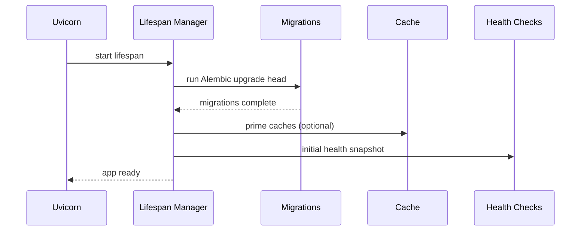
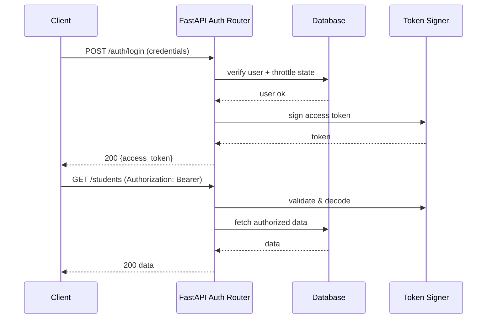
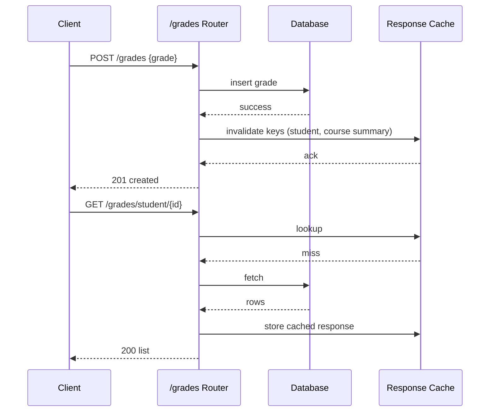
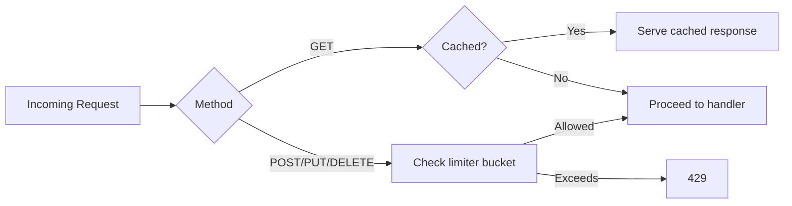

# Architecture Diagrams

**Status**: Draft
**Last Updated**: 2025-11-16
**Applies To**: v1.6.3+

Mermaid diagrams illustrating key system flows.

---

## 1. High-Level Deployment Modes

```mermaid
graph LR
  A[User Browser] --> B{Mode}
  B -->|Fullstack Docker| C[Single Container (FastAPI + React build)]
  B -->|Native Dev| D[FastAPI Backend]
  D --> E[Vite Dev Server]
  C --> F[SQLite DB Volume]
  D --> G[SQLite DB File]
```

---

## 2. Startup Lifespan Sequence



---

## 3. Authentication Flow



---

## 4. Grade Submission & Cache Invalidation



---

## 5. Rate Limiting Decision



---

## 6. Future Diagrams (TODO)

- Daily performance aggregation
- Attendance range query normalization
- Deployment rollback decision tree

---
**Reference**: See `docs/DOCUMENTATION_INDEX.md` for full documentation set.
